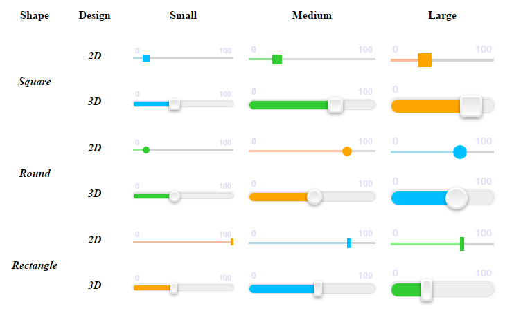

# Range/slider JavaScript component

Customizable slider (range) component (widget) for JavaScript with no external dependencies (*even jQuery!)*

Enhance your users' experience with an attractive and interactive way to input numbers.

## Features

- No dependencies!
- Totally responsive!
- Positive and negative integers supported
- Neat design: plain 2D or stylish 3D view, smooth fade animations
- 3 pre-defined themes and possibility to customize your own theme
- 3 pre-defined sizes
- 3 shapes of the handle: square, round or rectangle
- Popup showing current value when moving
- Control over min, max and current value labels visibility and placement
- Full control over the value: min-max bounds, integer step, unit of measurement, possibility to prevent from dragging
to a particular number under some circumstances
- Simple API to interact with the value
- OOP-style (`RangeSlider` class with settings hash in constructor)
- Source code in 3 samples: *ES 2015*, *ES 5.1* and *ES 5.1 minified*

## Supported browsers

Tested in:
- Chrome 56
- Firefox 51
- IE 10

IE 9 is semi-supported: slider functions well but 3D design looks strange there.

Should also work in all major browsers, but need to test. If you find it working in
lower versions of Chrome or FF, or in other browsers, please communicate to update the doc!

## Example

Download the repo folder and open `index.html` in your browser.

It uses some self-explaining examples to demonstrate widget's abilities.



An example of default initialization:

```html
<div id="slider"></div>
<script>
    new RangeSlider(document.getElementById("slider"));
</script>
```

OR

```javascript
var slider = new RangeSlider();
document.body.appendChild(slider.getElement());
```

Example of maximal configuration:

```javascript
// skip the first parameter if you want to create new element and attach it later
new RangeSlider(element, {
    step: 10,
    min: 80,
    max: 1000,
    value: 200,
    unit: "km/h",
    width: "75%",
    design: "3d",
    showMinMaxLabels: true,
    showCurrentValueLabel: true,
    labelsPosition: "bottom",
    popup: "bottom",
    theme: "attention",
    handle: "round",
    size: "large"
});
```

## Installation

### Using npm

`npm install range-slider`

Then in your JS code:

`require("range-slider")`

This will require minified file as a dependency.

It's assumed to work with both CommonJS or AMD, but needs to be tested. Please communicate if you confirm.

Don't forget to add CSS file manually!

### Simple download

Download one of the versions from [src](./src) directory (either [EcmaScript 6 full](./src/range-slider.es6),
[EcmaScript 5 full](./src/range-slider.js) or [EcmaScript 5 minified](./src/range-slider.min.js)).
Attach the script anywhere on your page.

Download [full](./css/range-slider.css) or [minified](./css/range-slider.min.css) CSS and attach to your page.

For example:

```html
<head>
    <link rel="stylesheet" href="css/range-slider.min.css">
</head>
<body>
    <div id="slider"></div>
    <script src="vendor/range-slider.min.js"></script>
    <script>
        new RangeSlider(document.getElementById("slider"), {
            min: 0,
            max: 10000,
            value: 1000,
            step: 50
        });
    </script>
</body>
```

### Repository

If you want to contribute or research the repo, clone it and run `npm install`.

Then run `npm run build` each time you want to compile and minify ES6 and CSS source code.

## API

### Settings

#### value

Type: `number|string`

Default: `0`

Initial value. If it's not integer it gets rounded. If it's outside of min-max boundary,
it is set to the closest allowed value.

String value is transformed to number when possible, otherwise default value is used.
The same is true for all numeric settings.

#### min

Type: `number|string`

Default: `0`

Minimal allowed value.

#### max

Type: `number|string`

Default: `100`

Maximal allowed value.

#### step

Type: `number|string`

Default: `1`

Step by which value gets changed when moving slider.

It is counted from the initial value, so min/max values cannot be reached in case they 
differ from initial value not by integer amount of steps (e.g. min 1, max 5, initial value 2, step 2).

#### unit

Type: `string`

Default: `null`

Unit of measurement (mm, ll, inch, km/h, %, etc). Displayed in labels and popup.

#### width

Type: `number|string`

Default: `null`

When not specified, default width of the element is used. So e.g. block element gets stretched by 100%.

When string is specified, it's used as a `width` css property (so all css units are supported).
When number is specified, it's transformed to a string by appending "px".

#### design

Type: `<"2d", "3d">`

Default: `"3d"`

General design of the slider: plain 2D or neat 3D (see example).

*Note that lower case is required for all string settings*

#### theme

Type: `<"default", "positive", "attention", string>`

Default: `"default"`

Color scheme of the slider.

If custom string is specified, you can customize your own theme
(see [Making your custom theme](#making-your-custom-theme) section below). In this case class name is added to
the slider element containing specified string: `rs-theme-${theme}`.

#### size

Type: `<"small", "medium", "large">`

Default: `"medium"`

Size of the slider. It is not related to the width of the component (see `width` property for this).

It defines height of the bar, size of the handler, font-size of labels, etc. Custom values are
not supported here.

#### handle

Type: `<"square", "round", "rect">`

Default: `"square"`

Shape of the handler of the slider.

#### popup

Type: `<"top", "bottom", null>`

Default: `"top"`

Defines position of the popup displayed when user is moving handler. You can change colors of the
popup with your custom CSS (see [changing popup color](#changing-popup-color) section below).

Use `null` (or any falsy value) to disable popup.

#### showMinMaxLabels

Type: `boolean`

Default: `true`

Whether to display min and max labels or not.

You can change labels styling with your custom CSS rules. See more in [changing labels style](#changing-labels-style) section.

#### showCurrentValueLabel

Type: `boolean`

Default: `false`

Whether to display current (actual) value label.

It is displayed near the handler and moves together with it. If you want to hide it during movement
and display only statically (i.e. only when user is not interacting with the slider), see
[hiding current value label during interaction](#hiding-current-value-label-during-interaction) section below.

When `popup` is enabled, current value label is hidden automatically during the movement.

#### labelsPosition

Type: `<"top", "bottom">`

Default: `"top"`

Defines position of max, min and current value labels.

### Callbacks

All callbacks are invoked with a context of the slider instance. So you can invoke its methods
inside of callbacks (e.g. `this.getValue()`, `this.setValue(x)`).

#### onstart(x: number): boolean|void

Called when user begins interacting with the slider. Single argument contains current value.

Return `false` to prevent interaction.

#### onfinish(x: number): void

Called when user ends interacting with the slider. Single argument contains new value.

#### onmove(x: number): boolean|void

Called when user moves handler **and** the value gets changed (not called on each cursor movement).
Single argument contains new value.

Return `false` to prevent the new value from being set (handler is not moved in that case).
This way you can exclude custom values from being set or handler to be moved under your custom
conditions.

### Methods

There are several public methods that can be called on the instance of slider (returned when calling
 `new RangeSlider(...)`). All other methods you find in code are private and should not be called
 from outside as it might break component functionality (or compatibility with future versions).
 
There are also several public static methods of `RangeSlider` class, but they are not really useful 
and hence not described here. You can learn more from code.

#### getValue(): number

Get current value.

#### setValue(x: number): void

Set value of the slider.

If it's not integer or is outside of max/min bounds, it gets rounded
to the closest allowed value.

#### getElement(): HTMLElement

Get DOM element of the slider.

#### setWidth(w: number|string): void

Set width of the slider.
 
Number is transformed to string by adding "px". String represents CSS width 
of the slider element.

#### labelValue([value: number]): string

Get value suffixed with the unit of measure.

If value parameter is not specified, current value is used.

## CSS customization

It is possible to customize slider parts' colors and visibility with your own CSS rules.
Sizes are also possible to customize, but it's much harder as they involve many dependencies 
in css rules.

Here are described some useful cases. For everything else feel free to modify or override existing
CSS rules.

All class names of the component parts are prefixed with "rs-" to avoid conflicts with other rules in your project.

### Making your custom theme

It is possible to specify your own theme name in the slider settings, e.g:

```javascript
new RangeSlider({
    theme: "custom"
});
```

In this case class name will be added to the slider element formed as `rs-theme-${theme}`
("rs-theme-custom" for the example specified above).

You can customize your theme then with the following CSS (assumed theme is set to "custom"):

```css
.rs-theme-custom .rs-progress,
.rs-theme-custom .rs-progress::before {
    background: pink;
}
.rs-theme-custom .rs-handle {
    background: deeppink;
}
.rs-theme-custom.rs-design-3d .rs-progress,
.rs-theme-custom.rs-design-3d .rs-progress::before {
    background: red;
}
```

The first rule is used to set general progress-bar color.

The second rule is used to set handler color in both 2D and 3D modes (you can differentiate
between the modes by adding `.rs-desing-2d` or `.rs-design-3d` class to the outer selector).

The third rule is used to adjust progress-bar color in 3D mode.

### Changing popup color

To change color of the popup use the following selectors:

```css
.range-slider .rs-popup {
    background: black;
    color: white;
}
.range-slider .rs-popup-top::after {
    border-top-color: black; /* same as background above! */
}
.range-slider .rs-popup-bottom::after {
    border-bottom-color: black; /* same as background above! */
}
```

The last 2 rules are needed to also customize small triangle of the popup.

*Make sure your rules have higher priority than default! I.e. they are included after component's stylesheet,
or they use your custom theme selector like `.range-slider.rs-theme-custom` instead of simple `.range-slider`.*

### Changing labels style

To change labels color or font use selector `.rs-labels`.

To change particular label use one of `.rs-labels .rs-label-left`, `.rs-labels .rs-label-right` or
`.rs-labels .rs-label-middle` selectors.

*Make sure your rules have higher priority than default! I.e. they are included after component's stylesheet,
or they use your custom theme selector like `.range-slider.rs-theme-custom` before `.rs-labels`.*

### Hiding current value label during interaction

In general, to adjust slider styling during interaction, use `.range-slider.rs-active` outer selector.

If you want to see current value label, but to hide it when user is moving the slider, and if
you don't use popup, you can add the following CSS rule:

```css
.range-slider.rs-active .rs-label-middle {
    display: none;
}
```

If you want to enable fading animation for current value label when it's hiding and showing, use
`opacity: 0` instead of `display: none`. But in this case it will blink when value is changed instantly
by clicking on progress bar rather than by moving the handler.

## TODO

- add more public methods to control the component dynamically
- validate all settings and prevent from XSS
- add ability for selecting range of values?

*Alexey Grinko, 2017 (c)*